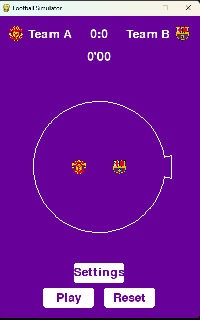

# Football Simulator

A simple football (soccer) simulation game built with PyGame, where team logos bounce inside a circular field and try to score by passing through a rotating goal.



## Features

- Physics-based team movement and collisions
- Rotating goal that teams need to enter to score
- Custom team names and logos
- Adjustable animation speed
- Match duration of 30 seconds (representing a 90-minute match)
- Score tracking and visual effects when scoring
- Settings menu to customize game parameters
- End-of-match screen showing final results

## Requirements

- Python 3.6 or higher
- PyGame 2.0 or higher

## Installation

1. Clone this repository or download the files
2. Install PyGame if you haven't already:
```bash
pip install pygame
```
3. Run the game:
```bash
python main.py
```

## File Structure

- `main.py` - Entry point of the application
- `game.py` - Main game logic and loop
- `team.py` - Team class for handling team properties and rendering
- `settings.py` - Settings management
- `ui.py` - User interface elements

## Customization

### Team Logos

To use custom team logos, add the following files to the game directory:
- `team1_logo.png` - Logo for Team A
- `team2_logo.png` - Logo for Team B

If these files aren't found, the game will use colored circles with letters as fallbacks.

### Game Settings

You can adjust the following settings in the game:
- Team names
- Rotation speed of the goal

## How to Play

1. Click "Play" to start the match
2. Watch as the team emblems bounce around and try to score
3. A team scores when its emblem passes through the goal opening
4. The match ends after 30 seconds of game time (shown as 90 minutes)
5. Click "Settings" to customize team names and game speed
6. Click "Reset" to start a new match

## Physics

The game simulates basic physics including:
- Boundary collisions with proper angle reflection
- Team-to-team collisions with momentum exchange
- Goal detection when a team passes through the opening

## License

This project is open source and available under the MIT License.

## Credits

Developed as a PyGame implementation of a popular social media football animation concept.
